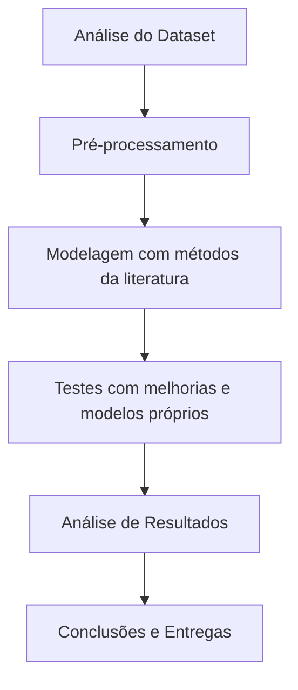

<p align="center">
  
  
  
  
  
  
  
</p>

<h1 align="center">♻️ Warp Waste Classification</h1>

## 📑 Índice

- [📑 Índice](#-índice)
- [📝 Descrição](#-descrição)
- [🎯 Objetivo](#-objetivo)
- [🔥 Atividades do Projeto](#-atividades-do-projeto)
  - [✅ **ATIV-04-ET-01 — Análise do Dataset**](#-ativ-04-et-01--análise-do-dataset)
  - [✅ **ATIV-04-ET-02 — Pesquisa de Métodos + Propostas**](#-ativ-04-et-02--pesquisa-de-métodos--propostas)
  - [✅ **ATIV-04-ET-03 — Metodologia, Resultados e Conclusões**](#-ativ-04-et-03--metodologia-resultados-e-conclusões)
- [🧠 Pipeline do Projeto](#-pipeline-do-projeto)
- [📊 Dataset](#-dataset)
- [🗺️ Estrutura do Projeto](#️-estrutura-do-projeto)
- [📑 Metodologia](#-metodologia)
- [📈 Métricas de Avaliação](#-métricas-de-avaliação)
- [🚀 Como Executar o Projeto](#-como-executar-o-projeto)
  - [1️⃣ Clone este repositório:](#1️⃣-clone-este-repositório)
  - [2️⃣ Acesse a pasta do projeto:](#2️⃣-acesse-a-pasta-do-projeto)
  - [3️⃣ Crie um ambiente virtual:](#3️⃣-crie-um-ambiente-virtual)
  - [4️⃣ Ative o ambiente virtual:](#4️⃣-ative-o-ambiente-virtual)
  - [5️⃣ Instale as dependências:](#5️⃣-instale-as-dependências)
  - [6️⃣ Execute os notebooks ou scripts na pasta `/notebooks` ou `/src`.](#6️⃣-execute-os-notebooks-ou-scripts-na-pasta-notebooks-ou-src)
- [🔧 Tecnologias e Bibliotecas](#-tecnologias-e-bibliotecas)
- [👥 Squad](#-squad)
- [📜 Licença](#-licença)

---

## 📝 Descrição

O **Warp Waste Classification** é um projeto de Machine Learning que utiliza técnicas de Visão Computacional para classificar resíduos recicláveis. O modelo é capaz de identificar materiais como **papel, plástico, vidro, metal e lixo orgânico**, auxiliando na automação de processos de triagem de resíduos sólidos.

---

## 🎯 Objetivo

- Desenvolver modelos preditivos para classificar imagens de resíduos recicláveis.  
- Contribuir para soluções de sustentabilidade e automação na gestão de resíduos.  
- Aplicar técnicas de aprendizado de máquina e visão computacional.  

---

## 🔥 Atividades do Projeto

### ✅ **ATIV-04-ET-01 — Análise do Dataset**
- ✔️ Verificar integridade dos arquivos.
- ✔️ Checar consistência dos metadados.
- ✔️ Avaliar qualidade das imagens.
- ✔️ Analisar distribuição das classes.
- ✔️ Identificar e tratar imagens duplicadas.

### ✅ **ATIV-04-ET-02 — Pesquisa de Métodos + Propostas**
- ✔️ Implementar e testar métodos da literatura (disponíveis no próprio Kaggle e outros artigos).
- ✔️ Propor melhorias, como:
  - Otimização de hiperparâmetros.
  - Arquiteturas mais leves e rápidas.
  - Redução do conjunto de treino mantendo a performance.

### ✅ **ATIV-04-ET-03 — Metodologia, Resultados e Conclusões**
- ✔️ Documentar a metodologia adotada.
- ✔️ Comparar resultados entre modelos da literatura e modelos próprios.
- ✔️ Apresentar tabelas, gráficos e métricas.
- ✔️ Elaborar conclusões, aprendizados e sugestões de melhorias futuras.

---

## 🧠 Pipeline do Projeto



---

## 📊 Dataset

- 📦 **Nome:** Warp Waste Recycling Plant Dataset  
- 🔗 **Link:** [Kaggle - Warp Waste Recycling Plant Dataset](https://www.kaggle.com/datasets/parohod/warp-waste-recycling-plant-dataset)  

**Descrição:**  
O dataset contém imagens categorizadas de resíduos recicláveis, incluindo papel, metal, vidro, plástico, entre outros, utilizadas para treinamento, validação e teste de modelos de classificação de imagens.

⚠️ As imagens não estão neste repositório. Para utilizar, faça o download no Kaggle e coloque na pasta `/data`.

---

## 🗺️ Estrutura do Projeto

```plaintext
warp-waste-classification/
├── data/              → Dados brutos (não incluídos no GitHub)
│   └── README.md      → Instruções sobre como obter os dados
├── docs/              → Documentação e apresentações
├── notebooks/         → Notebooks de exploração, EDA, modelagem e análise
├── outputs/           → Resultados, gráficos e modelos treinados
├── src/               → Scripts Python (EDA, pré-processamento, modelagem)
├── .gitignore         → Arquivos e pastas ignorados no versionamento
├── LICENSE            → Licença MIT
├── README.md          → Documentação do projeto (este arquivo)
└── requirements.txt   → Dependências do projeto
```

---

## 📑 Metodologia

- ✅ **Análise Exploratória dos Dados (EDA)**
- ✅ **Pré-processamento**
- ✅ **Treinamento e Avaliação de Modelos**
- ✅ **Aprimoramento de Modelos (Hiperparâmetros, Arquitetura)**
- ✅ **Análise de Resultados e Conclusões**

---

## 📈 Métricas de Avaliação

- Acurácia
- Precisão
- Recall
- F1-Score
- Matriz de Confusão

---

## 🚀 Como Executar o Projeto

### 1️⃣ Clone este repositório:

```bash
git clone https://github.com/seu-usuario/warp-waste-classification.git
```

### 2️⃣ Acesse a pasta do projeto:

```bash
cd seu-repositorio
```

### 3️⃣ Crie um ambiente virtual:

```bash
python -m venv venv
```

### 4️⃣ Ative o ambiente virtual:

- Windows:

```bash
venv\Scripts\activate
```

- Linux/Mac:

```bash
source venv/bin/activate
```

### 5️⃣ Instale as dependências:

```bash
pip install -r requirements.txt
```

### 6️⃣ Execute os notebooks ou scripts na pasta `/notebooks` ou `/src`.

---

## 🔧 Tecnologias e Bibliotecas

- **Linguagem:** Python 3.10+
- **Bibliotecas:**
  - Pandas
  - NumPy
  - Scikit-Learn
  - TensorFlow ou PyTorch
  - OpenCV
  - Matplotlib
  - Seaborn
  - Jupyter Notebook
- **Ferramentas:**
  - Kaggle
  - Google Colab ou JupyterLab
  - Git e GitHub

---

## 👥 Squad

<table align="center">
  <tr>
    <td align="center">
      <a href="https://www.linkedin.com/in/ana-sofia-moura-27b003248/">
        <br>
      </a>
      <sub>
          <b>Ana Sofia Moura</b>
         </sub>
    <br>
        <a href="https://github.com/Sun-cs-Sol">
            
        </a>
        <br>
        <a href="https://www.linkedin.com/in/ana-sofia-moura-27b003248/">
            
        </a>
    </td>
    <td align="center">
      <a href="https://github.com/Elineison">
        <br>
      </a>
      <sub>
          <b>Elineison de Sousa</b>
         </sub>
    <br>
        <a href="https://github.com/Elineison">
            
        </a>
        <br>
        <a href="https://www.linkedin.com/in/elineison-inacio-de-sousa/">
            
        </a>
    </td>
    <td align="center">
      <a href="https://www.linkedin.com/in/francis-lauriano-9b674a27b/">
        <br>
      </a>
      <sub>
          <b>Francis Lauriano</b>
         </sub>
    <br>
        <a href="https://github.com/FrancisLauriano">
            
        </a>
        <br>
        <a href="https://www.linkedin.com/in/francis-lauriano-9b674a27b/">
            
        </a>
    </td>
    <td align="center">
      <a href="https://www.linkedin.com/in/usuario-4">
        <br>
      </a>
      <sub>
          <b>Iza Vieira</b>
         </sub>
    <br>
        <a href="https://github.com/usuario-4">
            
        </a>
        <br>
        <a href="https://www.linkedin.com/in/usuario-4">
            
        </a>
    </td>
    <td align="center">
      <a href="https://www.linkedin.com/in/madelu-lopes-089388120/">
        <br>
      </a>
      <sub>
          <b>Madelu Lopes</b>
         </sub>
    <br>
        <a href="https://github.com/Mads8760">
            
        </a>
        <br>
        <a href="https://www.linkedin.com/in/madelu-lopes-089388120/">
            
        </a>
    </td>
        <td align="center">
      <a href="https://www.linkedin.com/in/usuario-6">
        <br>
      </a>
      <sub>
          <b>Mariana Angeli</b>
         </sub>
    <br>
        <a href="https://github.com/usuario-6">
            
        </a>
        <br>
        <a href="https://www.linkedin.com/in/usuario-6">
            
        </a>
    </td>
    <td align="center">
      <a href="https://www.linkedin.com/in/usuario-7">
        <br>
      </a>
      <sub>
          <b>Rodrigo Rocha</b>
         </sub>
    <br>
        <a href="https://github.com/usuario-7">
            
        </a>
        <br>
        <a href="https://www.linkedin.com/in/usuario-7">
            
        </a>
    </td>
    
  </tr>
</table>

---

## 📜 Licença

Este projeto está sob a licença **MIT** — Consulte o arquivo [LICENSE](LICENSE) para mais informações.  

Projeto desenvolvido exclusivamente para fins educacionais no contexto do **Bootcamp em Machine Learning**.

---
